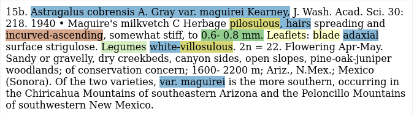
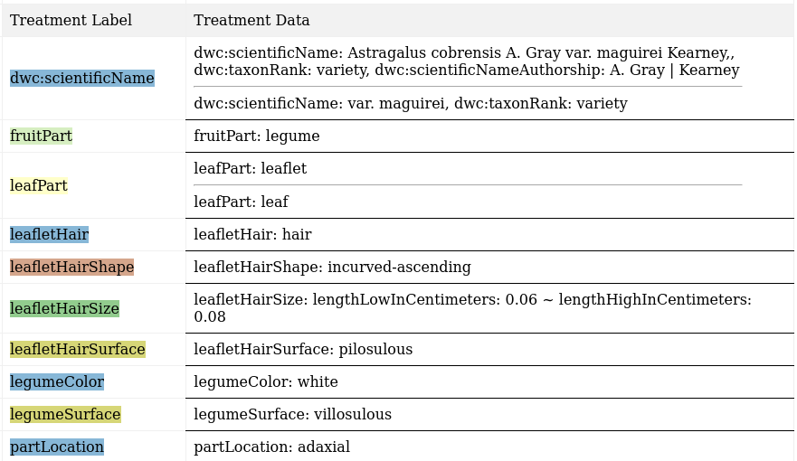

# FloraTraiter [](https://zenodo.org/badge/latestdoi/649758239)


Extract traits about plants from authoritative literature.

This repository merges three older repositories:
- `traiter_plants`
- `traiter_efloras`
- `traiter_mimosa`
- Parts of `digi_leap`

More merging for other Traiter repositories for plant traits may occur.

## All right, what's this all about then?
**Challenge**: Extract trait information from plant treatments. That is, if I'm given treatment text like: (Reformatted to emphasize targeted traits.)



I should be able to extract: (Colors correspond to the text above.)



## Terms
Essentially, we are finding relevant terms in the text (NER) and then linking them (Entity Linking). There are several types of terms:
1. The traits themselves: These are things like color, size, shape, woodiness, etc. They are either a measurement, count, or a member of a controlled vocabulary.
2. Plant parts: Things like leaves, branches, roots, seeds, etc. These have traits. So they must be linked to them.
3. Plant subparts: Things like hairs, pores, margins, veins, etc. Leaves can have hairs and so can seeds. They also have traits and will be linked to them, but they must also be linked to a part to have any meaning.
4. Sex: Plants exhibit sexual dimorphism, so we to note which part/subpart/trait notation is associated with which sex.
5. Other text: Things like conjunctions, punctuation, etc. Although they are not recorded, they are often important for parsing and linking of terms.

## Multiple methods for parsing
1. Rule based parsing. Most machine learning models require a substantial training dataset. I use this method to bootstrap the training data. If machine learning methods fail, I can fall back to this.

## Rule-based parsing strategy
1. I label terms using Spacy's phrase and rule-based matchers.
2. Then I match terms using rule-based matchers repeatedly until I have built up a recognizable trait like: color, size, count, etc.
3. Finally, I associate traits with plant parts.

For example, given the text: `Petiole 1-2 cm.`:
- I recognize vocabulary terms like:
    - `Petiole` is plant part
    - `1` a number
    - `-` a dash
    - `2` a number
    - `cm` is a unit notation
- Then I group tokens. For instance:
    - `1-2 cm` is a range with units which becomes a size trait.
- Finally, I associate the size with the plant part `Petiole` by using another pattern matching parser. Spacy will build a labeled sentence dependency tree. We look for patterns in the tree to link traits with plant parts.

There are, of course, complications and subtleties not outlined above, but you should get the gist of what is going on here.

## Install
You will need to have Python3.11+ installed, as well as pip, a package manager for Python.
You can install the requirements into your python environment like so:
```bash
git clone https://github.com/rafelafrance/FloraTraiter.git
cd FloraTraiter
python3.11 -m venv .venv
source .venv/bin/activate
python -m pip install -U pip setuptools wheel
python -m pip install .
python -m pip install git+https://github.com/rafelafrance/traiter.git@master#egg=traiter
python -m spacy download en_core_web_md
```

### Taxon database

A taxon database is included with the source code, but it may be out of date. I build a taxon database from 4 sources. The 3 primary sources each have various issues, but they complement each other well.

1. [ITIS sqlite database](https://www.itis.gov/downloads/index.html)
2. [The WFO Plant List](https://wfoplantlist.org/plant-list/classifications)
3. [Plant of the World Online](http://sftp.kew.org/pub/data-repositories/WCVP/)
4. [Some miscellaneous taxa not found in the other sources.](flora/pylib/rules/terms/other_taxa.csv)

Download the first 3 sources and then use the `util_add_taxa.py` script to extract the taxa and put them into a form the parsers can use.

## Repository details

## Tests
There are tests which you can run like so:
```bash
export MOCK_TAXA=1; python -m unittest discover
```

Please `export MOCK_TAXA=0` before you run any scripts on real data.
